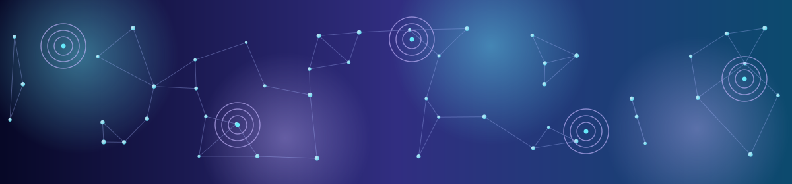

<!-- Profile README for Phanindra Babu B J -->

  

  

  

  

---

## 🌌 Origin story

My curiosity started with physics — especially light, mathematics, and the strange ways the universe behaves. That curiosity eventually led me from experimenting with physical phenomena to experimenting with computational intelligence.

Today, I work across **Artificial Intelligence**, **Machine Learning**, **Generative AI**, **Graph AI**, **MLOps**, and **Quantum Computing** — building systems that sit somewhere between what machines can learn and what we're still trying to understand about computation itself.

I don't just want to use technology. I want to understand what makes it work — and then build something better.

<i>Code is my laboratory. Curiosity is my constant.</i>

## 🧬 Neural profile

I'm a software engineer who enjoys turning ideas into polished, practical products. I work across **full-stack development**, **AI/ML**, **Graph AI**, and **MLOps**, while exploring the frontier where **GenAI** and **quantum computing** meet.

<table>
  <tr>
    <td width="33%" align="center"><b>⚙️ I engineer</b> Scalable, user-focused digital experiences.</td>
    <td width="33%" align="center"><b>✦ I explore</b> GenAI, Graph AI, and intelligent workflows.</td>
    <td width="33%" align="center"><b>◌ I investigate</b> Quantum ideas, ML systems, and what comes next.</td>
  </tr>
</table>

## ⚡ Tech constellation

